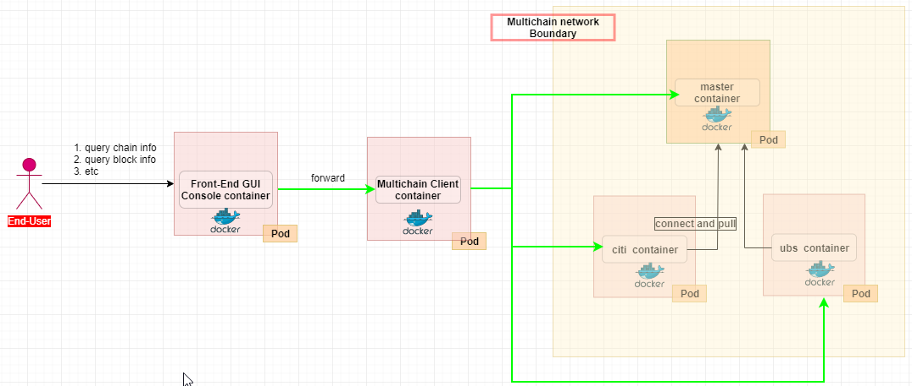

# MultichainClient
> A simple multichain client to operate multichain network

### Introduction
> This Simple Project is used to operate the multichain network like query block info, send data and issue aset and other multichain related operation. This project uses an opensource multichain sdk <https://github.com/SimplyUb/MultiChainJavaAPI> which i forked to my own repo <https://github.com/menglong567/MultiChainJavaAPI>
>
>For multichain product please go to <https://www.multichain.com/>

This is just a sub-project of the MLBaaSPlatform , please refer to https://github.com/menglong567/MLBaaSPlatfrom for the whole picture of the BaaS

### Architecture
> Here i'm giving the whole picture of this simple project as below

### Support or Contact
> If you have question please contact me via menglong567@aliyun.com
